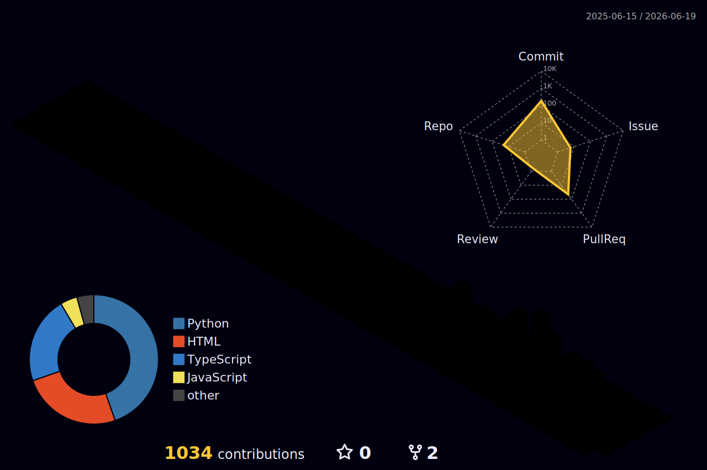

<!-- ===================== HEADER ===================== -->

  

  

  
  
  
  
  

<!-- ===================== ABOUT ===================== -->
## 👋 About

Security engineer and **AI security researcher**. I design and build **enterprise-grade security systems** — LLM/agent **guardrails**, autonomous **red-teaming**, **SAST**, **agentic identity (IdP)**, and **cloud security** — and I break AI systems before attackers do.

🛡️ ISC2 member &nbsp;·&nbsp; 🚩 CTF competitor &nbsp;·&nbsp; 🥇 ISACA phishing champion &nbsp;·&nbsp; 🎓 MS Cybersecurity, Yeshiva University

- 🔭 **Building** systems for AI/LLM security, secure SDLC, and cloud posture
- 🧠 **Researching** agentic red-teaming, prompt-injection & tool-abuse defenses
- 💬 **Ask me about** LLM guardrails, AI red-teaming, SAST, and AWS security
- 📫 **Reach me** at **saivarmadpr@gmail.com**

<!-- ===================== WHAT I BUILD ===================== -->
## ⚒️ What I build

| Domain | What I ship |
| :-- | :-- |
| 🛡️ **AI & LLM Guardrails** | Guardrail frameworks and testing harnesses that keep LLM/agentic apps safe, policy-aligned, and jailbreak-resistant. |
| 🤖 **AI Red-Teaming** | Agentic red-team systems that autonomously hunt prompt injection, tool-abuse, and jailbreaks across multi-turn attack chains. |
| 🔍 **SAST & AppSec** | Static analysis and secure-SDLC tooling that catches vulnerabilities before they ship. |
| 🪪 **Agentic Identity (IdP)** | Identity, authn/z, and least-privilege scoping for autonomous AI agents. |
| ☁️ **Cloud Security** | Secure AWS architectures, cloud posture management (CSPM), and deception/honeypots that surface attacker TTPs. |

<!-- ===================== ARSENAL ===================== -->
## 🧰 Tech arsenal

**AI / ML & LLM Security**

**Offensive Security**

**Cloud & DevSecOps**

**Languages**

<!-- ===================== FEATURED ===================== -->
## 🚀 Featured projects

### 🤖 [wb-red-team](https://github.com/votal-ai-hq/wb-red-team) &nbsp;·&nbsp; `votal-ai-hq`
Whitebox & blackbox **red-teaming framework for LLMs & agentic AI**. Analyzes app source code to map tools, roles, and guardrails, then auto-generates adaptive multi-turn attack chains across categories to surface real vulnerabilities.

<table>
<tr>
<td width="50%" valign="top">

### 🛡️ [guardrail-testing-platform](https://github.com/saivarmadpr/guardrail-testing-platform)
A platform for testing and benchmarking **LLM guardrails** — probing safety boundaries, policy compliance, and failure modes for AI/agentic apps.

</td>
<td width="50%" valign="top">

### ☁️ [Cloud Posture & Deception](https://github.com/saivarmadpr/Cloud_Security_Posture_-_Deception_Platform)
Capstone: **AI-deployed honeypots** that lure attackers and analyze their TTPs, plus cloud **misconfiguration scanning** to cut incidents.

</td>
</tr>
<tr>
<td width="50%" valign="top">

### 🔐 [AWS Cloud Security](https://github.com/saivarmadpr/AWS-Cloud-Security-Project)
Secure **AWS reference architecture** — VPC, IAM, WAF, GuardDuty, Security Hub, and CloudFormation automation following AWS best practices.

</td>
<td width="50%" valign="top">

### 🚩 [CTF Showcase](https://github.com/saivarmadpr/CTF-Showcase)
Writeups from Yeshiva University's CTF — **web exploitation**, **cryptography**, and **network forensics**, with custom scripts and tooling.

</td>
</tr>
</table>

<!-- ===================== CREDENTIALS ===================== -->
## 🏆 Credentials & wins

- 🥇 **1st place** — Phishing Competition, **ISACA**
- 🥈 **2nd place** — CTF Competition, **Yeshiva University**
- 📜 **ISC2 Certified in Cybersecurity (CC)** &nbsp;·&nbsp; **ISC2 Member**
- 🎓 **MS in Cybersecurity** — Yeshiva University

<!-- ===================== STATS ===================== -->
## 📊 GitHub analytics

### 🛰️ Deep metrics (includes private contributions)

  

## 🐍 Contribution graph

  

<!-- ===================== CONNECT ===================== -->
## 🤝 Let's connect

  
  
  
  

  

